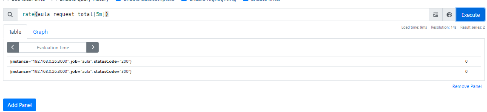

# observability-grafana-prometheus
Observability using Prometheus and Grafana.   

* Executar pela linha de comando para baixar e executar o Prometheus via Docker.  

```docker
 docker run --name prometheus --rm -d -p 9090:9090 \
 -v c:/Users/AS workspace/observability-grafana-prometheus/prometheus/prometheus.yml:/etc/prometheus/prometheus.yml  \
 prom/prometheus

```  

* Conferir se o container está sendo executado corretamente:    

    `docker container ls`  

* Acessar a url abaixo para garantir que o Prometheus está sendo executado no browser.  

    https://localhost:9090/graph   


* Para integrar o Prometheus na aplicação web, devemos utilizar as libraries que são disponibilizadas para instalar o client do Prometheus:  

  https://prometheus.io/docs/instrumenting/clientlibs


* Simulando uma aplicação em nodeJS, vamos instalar o Client Prometheus para ela.  

  `npm install --save prom-client`   

* Abaixo, a documentação do Cliente Prometheus com nodeJS:    

  https://github.com/siimon/prom-client


***

### Coletar métricas de hardware com Prometheus  

* Para coletar esse tipo de métricas, precisamos utilizar os exporters do Prometheus:  

    Documentação:  
     https://prometheus.io/docs/instrumenting/exporters/   

    https://github.com/prometheus   
***  
### PromQL   

PromQL é uma linguagem de consultas do próprio Prometheus.  Ela é utilizada para montar query com as métricas que foram coletadas.    

#### Tipo de dados no Prometheus:  

* Scalar
* Instant Vector
* Range Vector    

* Scalar, são números inteiros. O Vector é um vetor com séries temporais. Quando fazermos uma query, são retornadas séries temporais.   
* Instant Vector, é o timestamp, o tempo que está atrelado a busca. Toda busca está atrelada a um timestamp.  Exemplo de consulta: `aula_request_total`.  
* Range Vector, é o intervalo de coleta determinado por uma faixa de tempo, podendo ser definido entre segundo, minutos ... Exemplo de consulta: `aula_request_total[1m]`.  

#### Filtragem por Labels     

```docker
* aula_request_total{statusCode = "300"}   
* aula_request_total{statusCode !="300"}    
* aula_request_total{instance="192.168.0.26:3000", job="aula", statusCode="200"}   
* aula_request_total{job="aula",statusCode=~"200|500"}
```

#### Trabalhando com Counters   (Exemplos com funções rate e increase)

Documentação das funções do Prometheus:   
https://prometheus.io/docs/prometheus/latest/querying/functions/  

* Simulando a taxa média por segundo dos últimos 5 minutos  
  `rate(http_requests_total{job="api-server"}[5m])`   
* Simulando a média por minuto  
  `rate(aula_request_total[1m])`   

* Simulando o crescimento por minuto  
  `increase(aula_requests_total[1m])`

obs: para conseguir construir um gráfico, a queria precisa retornar um Istant Vector.   

    


#### Trabalhando com Histogramas   

