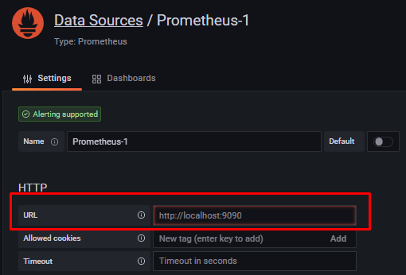
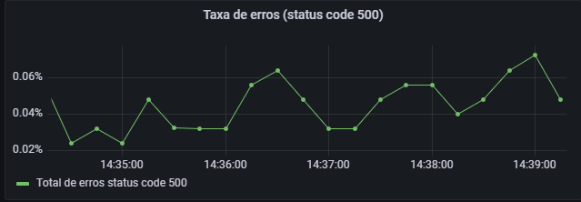
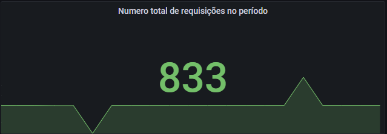

# observability-grafana-prometheus
Observability using Prometheus and Grafana.     

### Overview do Prometheus   

https://prometheus.io/docs/tutorials/getting_started/

* Executar pela linha de comando para baixar e executar o Prometheus via Docker.  

```docker
 docker run --name prometheus --rm -d -p 9090:9090 \
 -v c:/Users/AS workspace/observability-grafana-prometheus/prometheus/prometheus.yml:/etc/prometheus/prometheus.yml  \
 prom/prometheus
```  

* Conferir se o container está sendo executado corretamente:    

    `docker container ls`  

* Acessar a url abaixo para garantir que o Prometheus está sendo executado no browser.  

    https://localhost:9090/graph   


* Para integrar o Prometheus na aplicação web, devemos utilizar as libraries que são disponibilizadas para instalar o client do Prometheus:  

  https://prometheus.io/docs/instrumenting/clientlibs


* Simulando uma aplicação em nodeJS, vamos instalar o Client Prometheus para ela.  

  `npm install --save prom-client`   

* Abaixo, a documentação do Cliente Prometheus com nodeJS:    

  https://github.com/siimon/prom-client


***

### Coletar métricas de hardware com Prometheus  

* Para coletar esse tipo de métricas, precisamos utilizar os exporters do Prometheus:  

    Documentação:  
     https://prometheus.io/docs/instrumenting/exporters/   

    https://github.com/prometheus   
***  
### PromQL     

Documentação: https://prometheus.io/docs/prometheus/latest/querying/basics/

PromQL é uma linguagem de consultas do próprio Prometheus.  Ela é utilizada para montar query com as métricas que foram coletadas.    

#### Tipo de dados no Prometheus:  

* Scalar
* Instant Vector
* Range Vector    

* Scalar, são números inteiros. O Vector é um vetor com séries temporais. Quando fazermos uma query, são retornadas séries temporais.   
* Instant Vector, é o timestamp, o tempo que está atrelado a busca. Toda busca está atrelada a um timestamp.  Exemplo de consulta: `aula_request_total`.  
* Range Vector, é o intervalo de coleta determinado por uma faixa de tempo, podendo ser definido entre segundo, minutos ... Exemplo de consulta: `aula_request_total[1m]`.  

#### Filtragem por Labels     

```docker
* aula_request_total{statusCode = "300"}     
* aula_request_total{statusCode !="300"}     
* aula_request_total{instance="192.168.0.26:3000", job="aula", statusCode="200"}  
* aula_request_total{job="aula",statusCode=~"200|500"}  
```

#### Trabalhando com Counters   (Exemplos com funções rate e increase)   

Documentação das funções do Prometheus:   
https://prometheus.io/docs/prometheus/latest/querying/functions/  

* Simulando a taxa média por segundo dos últimos 5 minutos  
  `rate(http_requests_total{job="api-server"}[5m])`     
* Simulando a média por minuto  
  `rate(aula_request_total[1m])`    

* Simulando o crescimento por minuto  
  `increase(aula_requests_total[1m])`   

obs: para conseguir construir um gráfico, a queria precisa retornar um Istant Vector.   

      


#### Trabalhando com Histogramas    
Documentação:  https://prometheus.io/docs/prometheus/latest/querying/functions/#histogram_quantile    

* Exemplo de consulta. Analisar tempo de requisição de 90% das requisições por segundo no intervalo dos últimos 5 minutos.   
   `histogram_quantile(0.9,(rate(aula_request_time_seconds_bucket[5m])))`    

* Exemplo de quantidade de requisições com 300 ms no último 1 minuto.    
  `increase(aula_request_time_seconds_bucket[le="0.3"][1m])`   

* Percentual de requisições que levaram até 300ms   
  `sum(increase(aula_request_time_seconds_bucket[le="0.3"][1m]))/sum(increase(aula_request_time_seconds_count[1m]))`      
* Percentual de requisições que levaram até 300ms numa escala de zero a 100:    
    `100*sum(increase(aula_request_time_seconds_bucket[le="0.3"][1m]))/sum(increase(aula_request_time_seconds_count[1m]))`   

* Porcentual total de requisições duraram mais de 300 ms   
    `100 * (1 -(sum(increase(aula_request_time_seconds_bucket[le="0.3"][1m]))/sum(increase(aula_request_time_seconds_count[1m]))))`  


#### Operadores de agregação  

O `sum()` é o principal operador de agregação utilizado. Exemplos:   

  * `sum(aula_request_total)`   
  * `sum(aula_request_total) by(statusCode)`   
  * `sum(aula_request_total) by(job)`     

***   

### Grafana  

Instalação grafana via Docker:  

```docker
docker run -d --name=grafana -p 3000:3000 grafana/grafana-enterprise
```   

Para integrar o Grafana com o Prometheus, como utilizamos o container Docker, precisamos informar o IP da máquina que está executando o container para o Grafana.   
Para isso, precisamos instalar e executar o container do Grafana. Ao abri-lo (http://localhost:3000/) e informar que o Data Source que irá 'alimentar' o Grafana é o Prometheus e, em seguida, informar o IP da máquina e a porta em que o Prometheus está sendo executado.    
 
    


### Graficos   

Como escolhemos o Prometheus como data source, devemos utililzar o PromQL para construir as consultas dentro do Grafana. Abaixo os exemplode gráficos e consultas utilizadas.   

#### Total de requisições por minuto  (Tipo de visualização: time series)

   
Neste gráfico, foi utilizada a seguinte consulta:   

`sum(rate(aula_requests_total[1m]))*60`  

O operador `sum()` somara todas as requisições que estão agregadas dentro de `rate()` que calcula a média por segundo dentro de um intervalor de tempo. No caso, foi selecionado `[1m]`. Por fim, a multiplicação por `60` é para transformar o intervalo do minutos de decimal para números inteiros.    


### Tempo das requisições (Tipo de visualização: time series)

  

Para calcular o tempo das requsições, foram usadas as consultas:  

1. `histogram_quantile(0.99, sum by(le) (rate(aula_request_duration_seconds_bucket[1m])))`   

2. `histogram_quantile(0.95, sum by(le) (rate(aula_request_duration_seconds_bucket[1m])))`   

3. `histogram_quantile(0.90, sum by(le) (rate(aula_request_duration_seconds_bucket[1m])))`    

O tipo de gráfico foi o Histograma. Nele temos configurados alguns buckets que são definidos para registrar e contabilizar o tempo médio de um conjunto de requisições. Em `histogram_quantile(0.99 ...)` estamos chamando o bucket que registra o comportamento de 99% das requisições que, por sua vez, são agregadas por `rate` que define a média por segundo detro do invervalo que foi definido de 1 minuto.  
Nos pontos 2 e 3, é a mesma coisa, porém e contabilizada a duração de requisições de outros buckets, respectivamente o de 95% e 90% das requisições.  

### Total de usuários logados  (Tipo de visualização: Gauge) 
   
Este gráfico utiliza um Counter para somar os usuário logados. Para atender o valor, basta utilizar o nome da métrica definida.  

`aula_usuarios_logados_total`  

E configurar para que o valor apresentado seja __instant__ ao ivnés da média (avarage).   
 
### Taxa de erros - status code 500 (Tipo de visualização: time series)    
 
Para visualizarmos todas as requisições e suas taxas de erros, precisamos da seguinte consulta:  

`sum(rate(aula_requests_total{statusCode="500"}[1m])) / sum(rate(aula_requests_total[1m]))`   

Neste exemplo, somamos (`sum()`) a quantidade total da média de requisições por segundo (`rate()`) passando como label as que possuem `statusCode="500"` dentro do intervalo de 1 minuto. Para obtermos a porcentagem correta, tivemos que dividir o valor da operação acima pela soma total da média de requisições dentro do mesmo inteverlo, 1 minuto.    


### Número total de requisições por período (Tipo de visualização: stat) 

   

`sum(increase(aula_requests_total[$__range]))`   

Para obter o número total de requisições no instante correto que podemos definir no Grafana, utilizamos o `sum()` para somarmos o aumento dentro da série temporal que traz o número de requisições total. Para obter o valor da soma do aumento, utilizamos o `increase()` para ajustarmos com o número exato do range selecionado no grafana, precisamos passar no intervalo da query, a variável `[$_range]`. Ela é dinâmica e armazerá o valor defindo para o gráfico na interação com o Grafana.